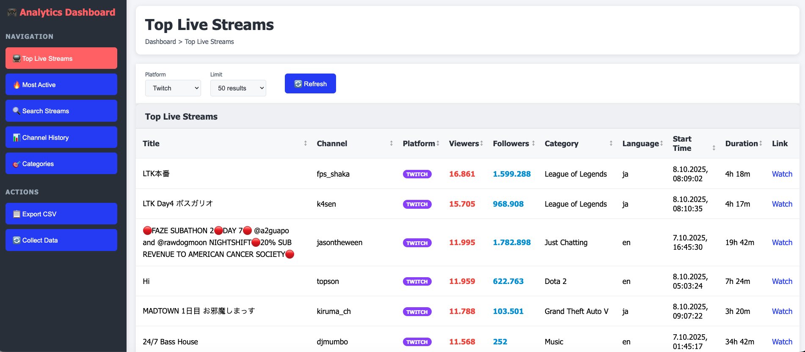
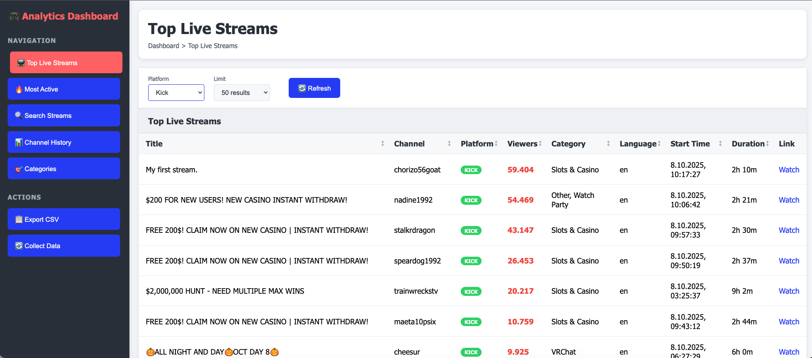
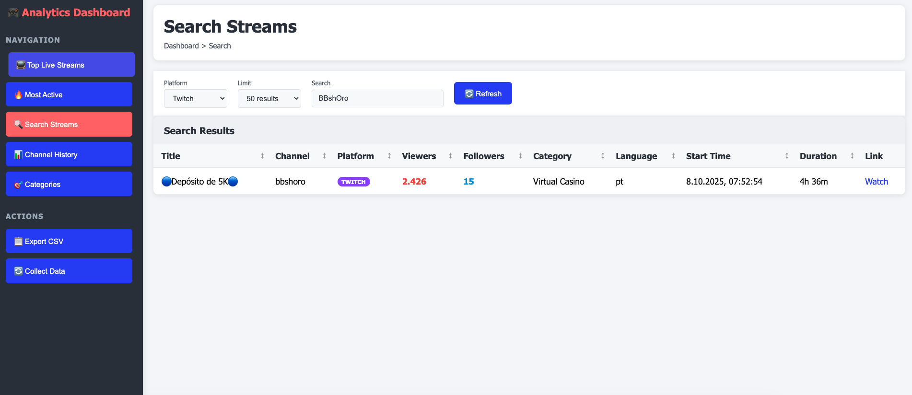
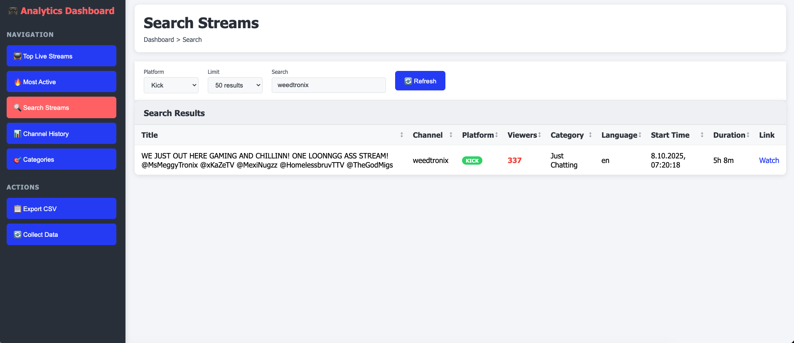
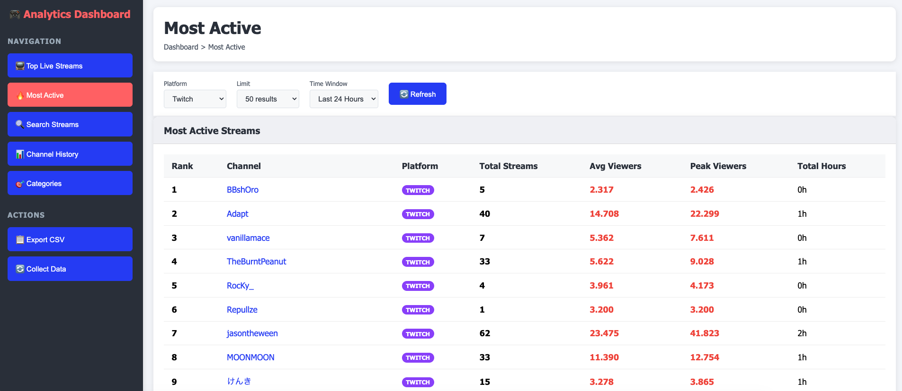
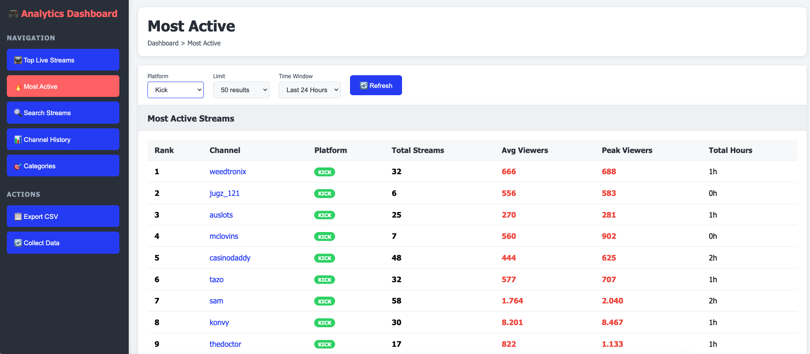
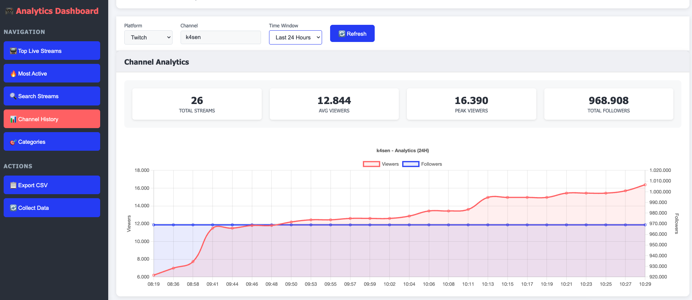
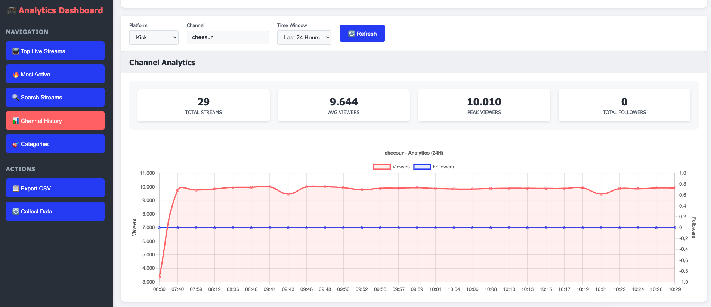
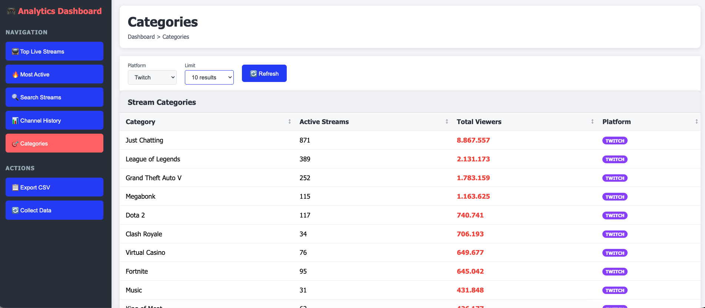

# Live Streaming Data Collection Dashboard

A local dashboard for collecting and analyzing live streaming data from Twitch and Kick.

## Quick Start

### 1. Prerequisites

- Python 3.11+
- PostgreSQL 14+

**Install PostgreSQL (macOS):**

```bash
brew install postgresql@14
brew services start postgresql@14
```

### 2. Setup Database

```bash
# Create user
psql postgres -c "CREATE USER streamdata WITH PASSWORD 'streamdata_password';"

# Create database
psql postgres -c "CREATE DATABASE streaming_platform OWNER streamdata;"
```

### 3. Run the Application

```bash
./start.sh
```

This will:

- Check Docker is running
- Check .env file exists
- Build and start containers with Docker Compose
- Start the application on [http://localhost:8000](http://localhost:8000)

### 4. Docker Quick Commands

```bash
# Start services
docker-compose up -d

# Stop services
docker-compose down

# View logs
docker-compose logs -f
```

## Access Points

- **Dashboard**: [http://localhost:8000](http://localhost:8000)
- **API Docs**: [http://localhost:8000/docs](http://localhost:8000/docs)
- **Health Check**: [http://localhost:8000/api/health](http://localhost:8000/api/health)

## Features

- ✅ Real-time data collection from Twitch and Kick
- ✅ Automatic collection every 2 minutes
- ✅ Search and filter streams
- ✅ View stream details (language, duration, start time)

## Screenshots

### Top Live Streams

**Twitch Streams:**


**Kick Streams:**


### Search and Filter

**Search Twitch Streams:**


**Search Kick Streams:**


### Most Active Streamers

**Most Active on Twitch:**


**Most Active on Kick:**


### Channel History

**Twitch Channel History:**


**Kick Channel History:**


### Categories Statistics

**Popular Categories on Twitch:**


## Manual Collection

Trigger data collection manually:

```bash
curl -X POST "http://localhost:8000/api/collect-all"
```

## Configuration

Edit `.env` file to configure:

- Database connection
- API credentials (Twitch, Kick)
- Collection interval

## Project Structure

```
├── app/
│   ├── main.py              # FastAPI application
│   ├── config.py            # Configuration
│   ├── database.py          # Database connection
│   ├── models.py            # SQLAlchemy models
│   ├── api/
│   │   └── routes.py        # API endpoints
│   └── collector/
│       ├── scheduler.py     # Data collection scheduler
│       ├── twitch.py        # Twitch API client
│       └── kick.py          # Kick API client
├── static/
│   └── index.html           # Dashboard UI
└── .env                     # Environment variables
```

## API Documentation

### Overview

The Live Streaming Data Collection API provides endpoints to access and analyze live streaming data collected from various platforms (currently Twitch and Kick).

### Base URL

**Base URL:**  

- `http://localhost:8000`

### Authentication

Currently, the API does not require authentication. In production, you should implement API keys or OAuth.

### Endpoints

#### 1. Get Top Live Streams

Retrieve the top live streams sorted by viewer count or follower count.

**Endpoint:** `GET /live/top`

**Query Parameters:**

- `platform` (string, default: "twitch"): Platform to query (twitch/kick)
- `limit` (integer, default: 50, max: 500): Number of results to return

**Example Request:**

```bash
# Top streams by current viewers
curl "http://localhost:8000/live/top?platform=twitch&limit=10"
```

**Example Response:**

```json
[
  {
    "platform": "twitch",
    "channel_id": "12345678",
    "username": "streamer_name",
    "display_name": "Streamer Name",
    "title": "Playing Awesome Game!",
    "viewers": 12345,
    "followers": 67890
  }
]
```
